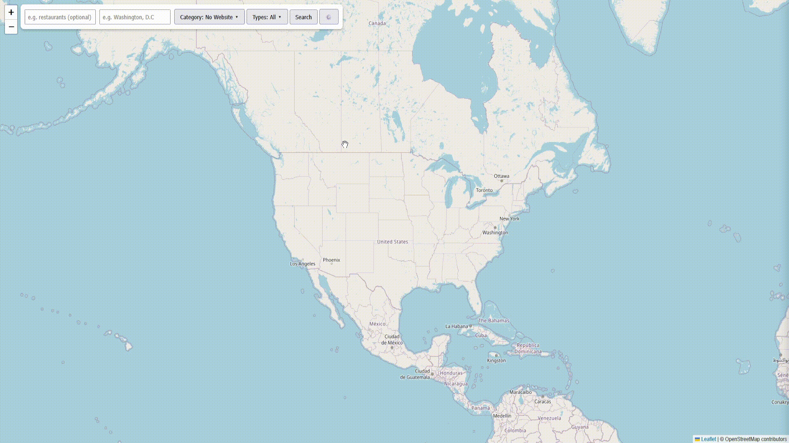

```text
  ▄▄▄▄▄▄                                             
 █▀██▀▀▀█▄                                   █▄      
   ██▄▄▄█▀▄                                 ▄██▄▄    
   ██▀▀▀  ████▄▄███▄ ▄██▀█ ████▄ ▄█▀█▄ ▄███▀ ██ ████▄
 ▄ ██     ██   ██ ██ ▀███▄ ██ ██ ██▄█▀ ██    ██ ██   
 ▀██▀    ▄█▀  ▄▀███▀█▄▄██▀▄████▀▄▀█▄▄▄▄▀███▄▄██▄█▀   
                           ██                        
                           ▀                          
```

## For Users (Where To Download)

1. Go to the [Releases page](../../releases) of this repo.
2. Download `Prospectr-Windows.zip` (Windows) or `Prospectr-Mac.zip` (Mac).
3. Unzip it and double-click `Prospectr`.
4. Your browser will open automatically to the app. Click the Settings button to paste in your Google Places and NVIDIA API keys — this only needs to be done once; the keys are saved next to the app.

## Getting And Using Keys

Inside the website you are required to obtain a Places API Key from google cloud

The settings can be found here



## For developers

Run from source (auto-reloads on code changes, good for development):

```bash

pip install -r requirements.txt

python core/app.py

```

## Building a new release

This repo uses GitHub Actions to build the Windows and Mac executable automatically. To publish a new version:

1. Commit your changes.
2. Tag the commit and push the tag, e.g.:

```bash

   git tag v1.0.0

   git push origin v1.0.0

```

1. GitHub Actions will build both executable (see the "Actions" tab for progress). Once done, download them from the workflow's build artifacts, zip each one, and attach them to a new GitHub Release so step 2 above for users has something to download.

